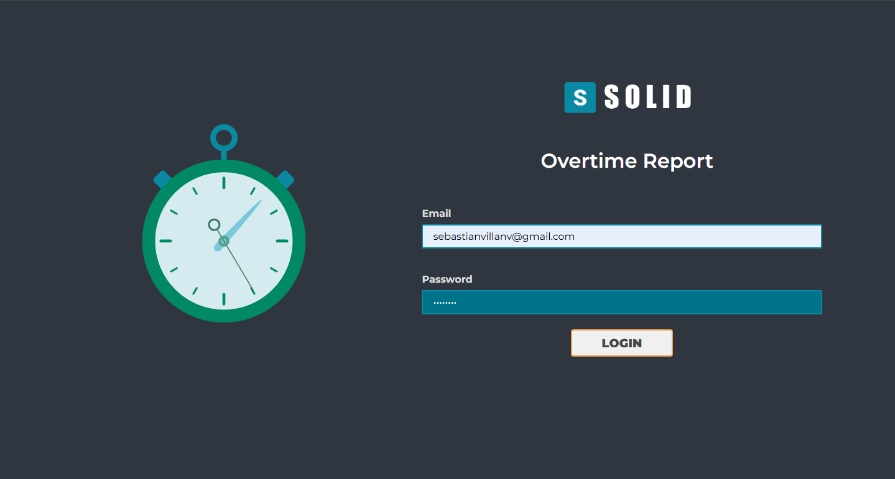
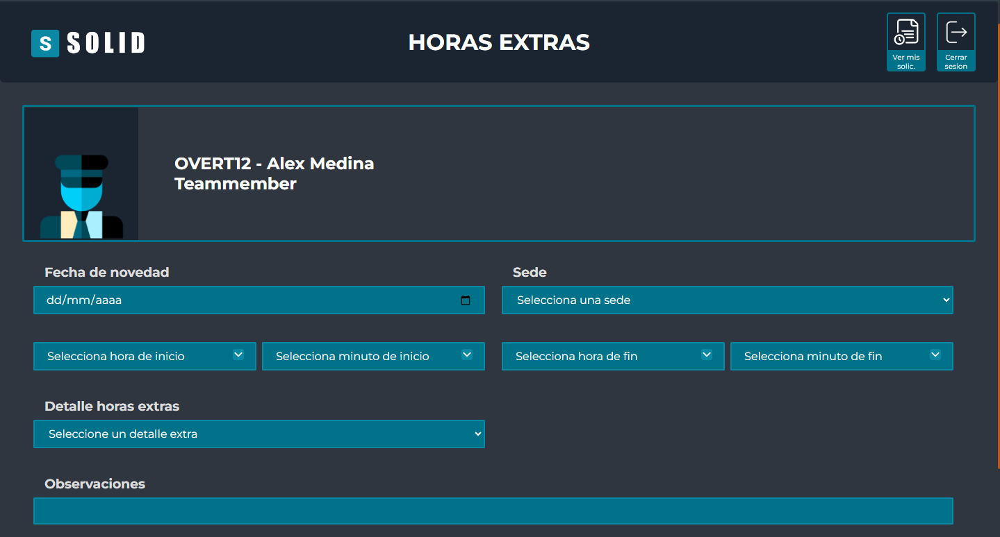
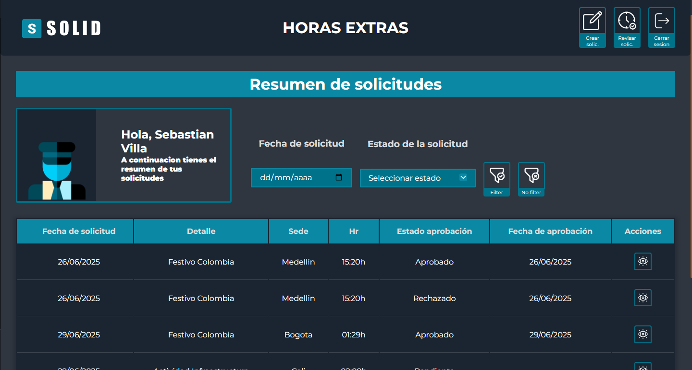
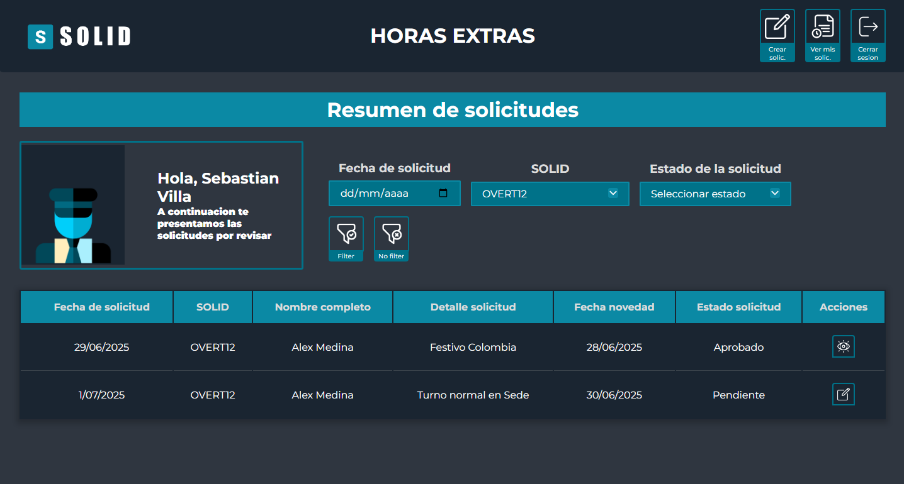
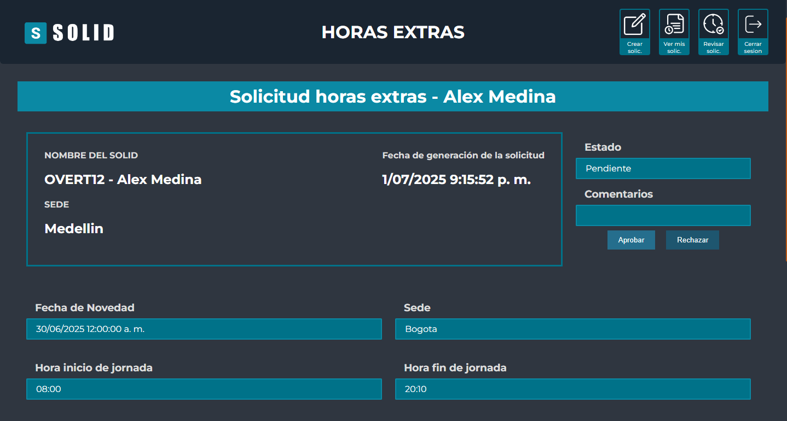
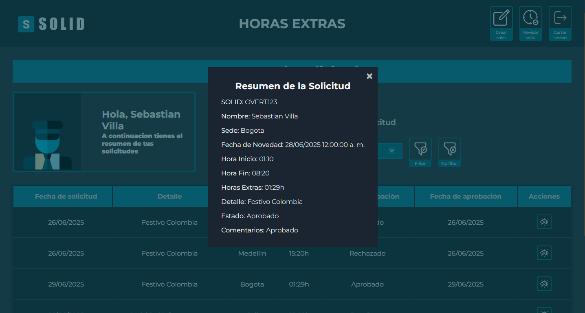

# 🕒 Overtime Report – Sistema de Gestión de Horas Extra

**Overtime Report** es una aplicación web integral diseñada para que empleados y líderes gestionen solicitudes de **horas extra** con cálculos automáticos basados en días festivos, trabajo nocturno, turnos extendidos y más. Este sistema facilita tanto el registro por parte del colaborador como la validación por parte del líder.

---

## 📌 Funcionalidades principales

### Para empleados
- Registrar solicitudes de horas extra indicando sede, horario y tipo de novedad.
- Ver el resumen de todas sus solicitudes (pendientes, aprobadas, rechazadas).
- Filtrar por fecha o estado.

### Para líderes / aprobadores
- Visualizar todas las solicitudes pendientes.
- Revisar detalles de cada novedad.
- Aprobar o rechazar con observaciones.

---

## 🛠 Tecnologías utilizadas

### 🔙 Backend (.NET)
- **.NET 7 (ASP.NET Core Web API)**
- **C#**
- **Entity Framework Core**
- **Clean Architecture**
- **MediatR** para el manejo de comandos y queries
- **CQRS** (Command Query Responsibility Segregation)
- **XUnit** para testing automatizado

### 🔜 Frontend (Web)
- **HTML5**
- **CSS3**
- **JavaScript Vanilla**
- Validaciones de formularios, lógica de filtrado, sesiones

---

## 🧱 Estructura del proyecto
OvertimeReport/
├── OvertimeReportBackend/ # API en .NET 7 con lógica de negocio
├── OverTimeReportFrontend/ # Interfaz del usuario (HTML, CSS, JS)
├── assets/ # Imágenes usadas en el README
└── README.md

---

## 📷 Capturas del sistema

### 🔐 Login

### 📄 Interfaz del empleado – Crear solicitud

### 📄 Interfaz del empleado – Mis solicitudes

### 📊 Gestión de reportes como líder

### 📝 Revisión detallada de una solicitud

### 📌 Modal resumen de solicitud

---

## ⚙️ Cómo ejecutar el proyecto

### 🖥 Backend (.NET)

1. Ir a `OvertimeReportBackend/`
2. Abrir con Visual Studio 2022 o superior.
3. Configurar la cadena de conexión en `appsettings.json`.
4. Ejecutar el proyecto con `F5` o `dotnet run`.

### 🌐 Frontend

1. Ir a `OverTimeReportFrontend/`
2. Abrir `login.html` en el navegador.

---

## 🧪 Pruebas

- Pruebas de unidad implementadas con **XUnit**
- Validación de lógica para cálculos de horas extra y flujo de aprobación

---

## 🧑‍💻 Autor

**Sebastián**  
📧 *sebastianvillanv@gmail.com*  
🔗 *https://github.com/Seiked*

---

## 📄 Licencia

Este proyecto es de uso libre para fines educativos y de portafolio.